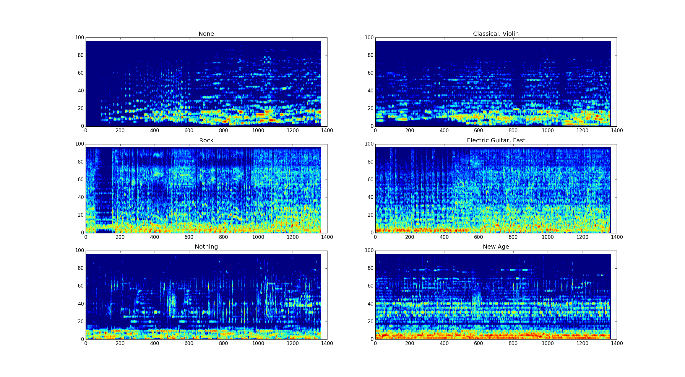
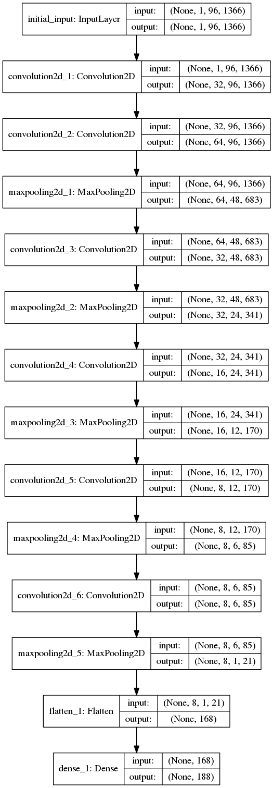
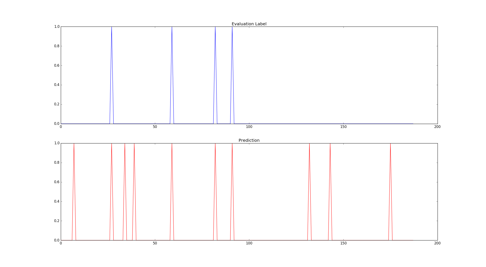
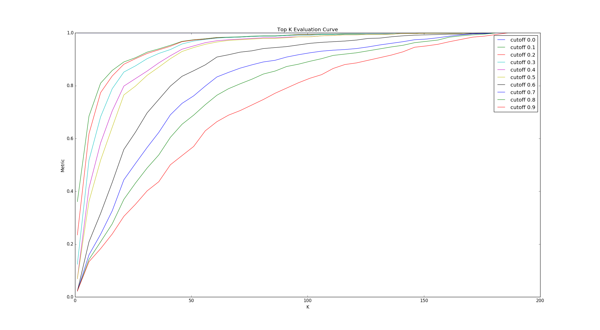
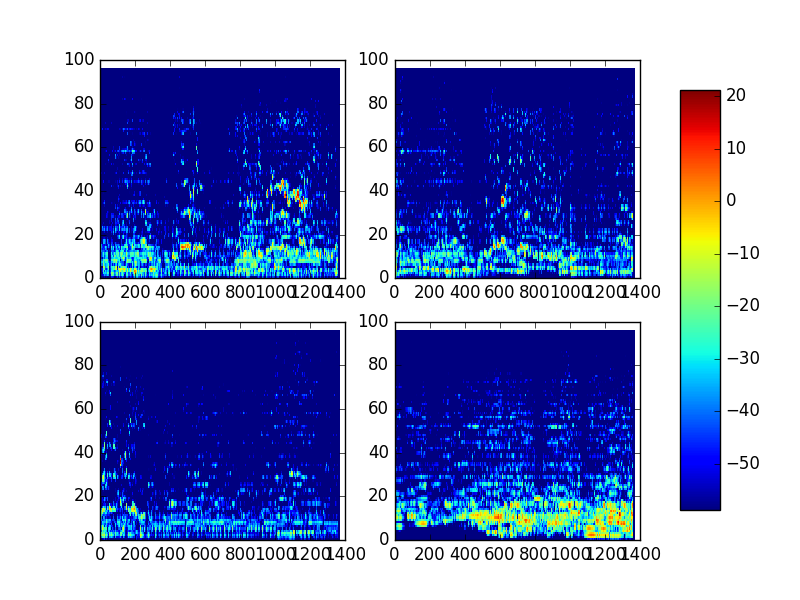
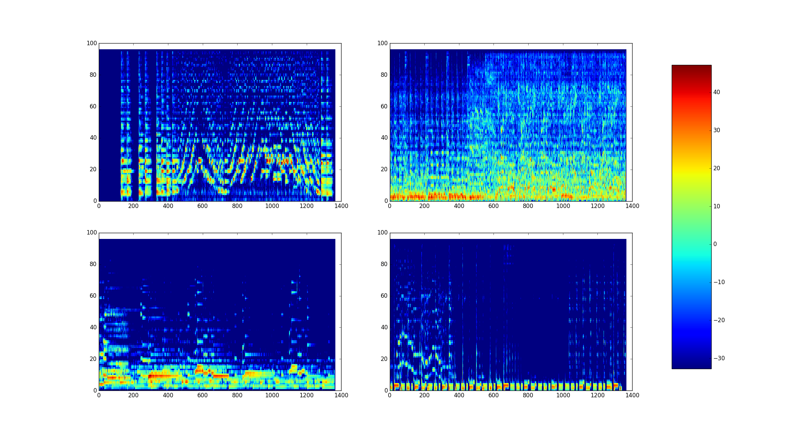
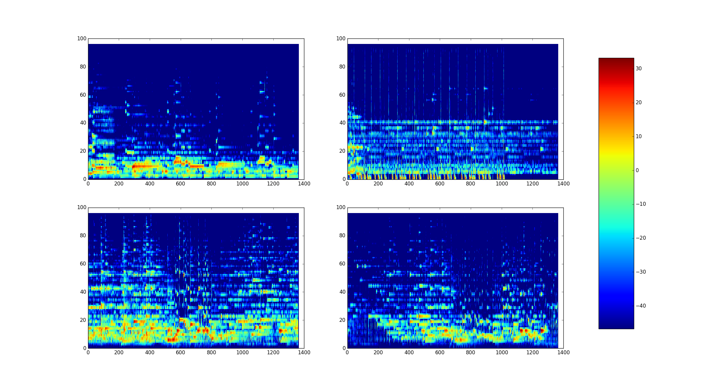
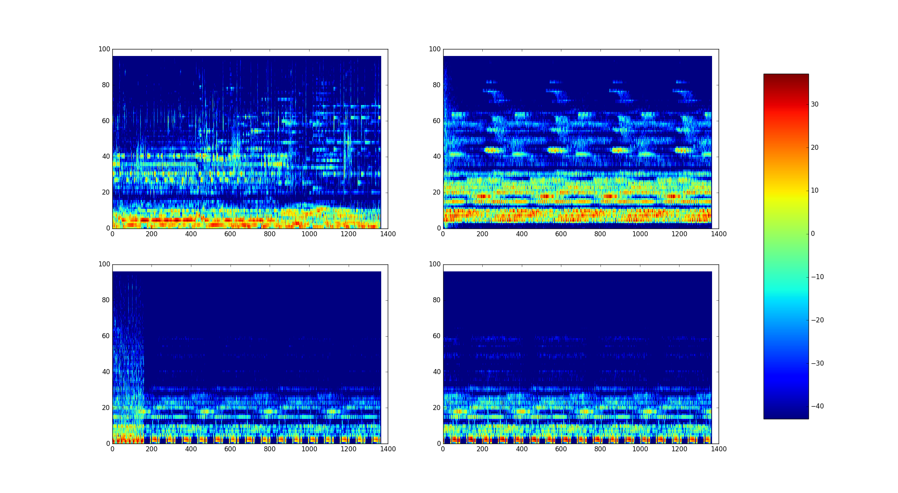
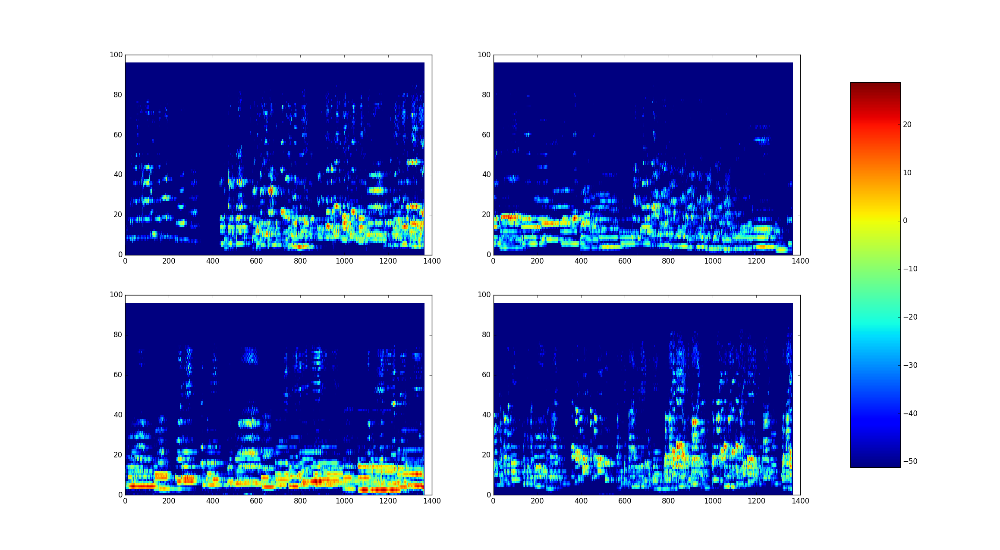
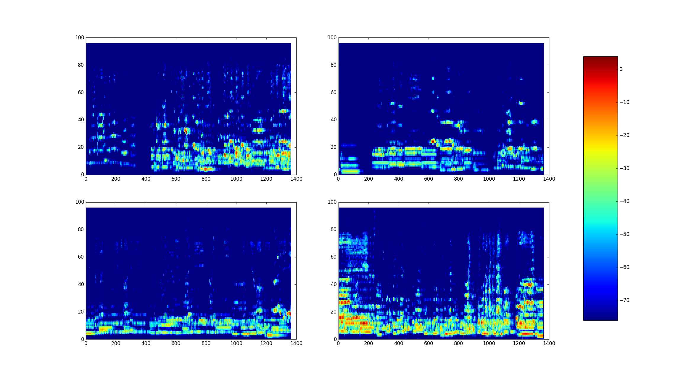

# DLA Interview Project
##Author 
* Name: Stephanie Kao
* Email: stephanie.kao5@gmail.com
* Phone: 775-544-9655

This README describes the development of an automated music genre tagger - a machine learning model that uses deep neural networks to categorize audio signals from a music file into one or more musical genre. This project focuses on deep learning architectures and analyzing/visualizing the results for improvements. The hope is to provide insight into the data patterns of audio signals and its association with genre. To access this README in more readable form, type the following in the terminal:

```
grip -b ~/dla/DLA/README.md 8080
```

## Problem Scope
Many music applications and recommendation engines rely upon tags/annotations to identify music files. Musical genre (rock, pop, hip-hop, gospel, etc) is an important tag to help categorize music and define musical taste. There is an interest to understand patterns in audio signals and whether they emulate a particular kind of musical genre. **The goal is to take a snippet audio signal from a song file and predict its musical genre (sans any other knowledge of the song such artist, song name, lyrics)**. Further applications of this problem include identifying new genres or groupings of audio signals, censoring/filtering/tagging incoming audio such as live TV censorship, and exploring signal patterns that are appeasing to the listener. What sound patterns do hardcore rock listeners enjoy as opposed to classical music listeners? Can this improve music recommendation?

The ground truth dataset is complicated and ambiguous for a couple reasons. (1) A song can fall into multiple genres (2) People classify songs differently and subjectively and so there is no "standard" classification dictionary. Certainly, the set of genres to use in classification is important. How do we define the set of genres? 

One way to approach this problem is to establish a diverse set of characterizations for music. These characterizations must be as comprehensive and generalized as possible. This way, an external party using the characterizations have the flexibility to define their own genre mapping. A song that is characterized by 'eerie', 'chanting', and 'dark' may be mapped to cult music by one opinion or mapped to haunting music by another. The model's purpose is to predict the characterizations and not be concerned with genre. The model should be able to predict several characterizations for the song in question. **Although this approach complicates the machine learning problem, it allows music to be a blend of several categories (which it should) and it asserts an objective characterization of music rather than a subjective labeling of genres.** For instance, it is a fact that a song contains bongos but it is a matter of opinion whether it's NY street music or tribal music. Lastly, this approach will broaden our ability to dissect the complexity of audio signals and identify how our feature maps can represent different blends.

This project will utilize the following annotation tags from [MagnaTagATune DataSet](http://mirg.city.ac.uk/codeapps/the-magnatagatune-dataset) for the model's characterization set:


```
['no voice', 'singer', 'duet', 'plucking', 'hard rock', 'world', 'bongos', 'harpsichord', 'female singing', 'clasical', 'sitar', 'chorus', 'female opera', 'male vocal', 'vocals', 'clarinet', 'heavy', 'silence', 'beats', 'men', 'woodwind', 'funky', 'no strings', 'chimes', 'foreign', 'no piano', 'horns', 'classical', 'female', 'no voices', 'soft rock', 'eerie', 'spacey', 'jazz', 'guitar', 'quiet', 'no beat', 'banjo', 'electric', 'solo', 'violins', 'folk', 'female voice', 'wind', 'happy', 'ambient', 'new age', 'synth', 'funk', 'no singing', 'middle eastern', 'trumpet', 'percussion', 'drum', 'airy', 'voice', 'repetitive', 'birds', 'space', 'strings', 'bass', 'harpsicord', 'medieval', 'male voice', 'girl', 'keyboard', 'acoustic', 'loud', 'classic', 'string', 'drums', 'electronic', 'not classical', 'chanting', 'no violin', 'not rock', 'no guitar', 'organ', 'no vocal', 'talking', 'choral', 'weird', 'opera', 'soprano', 'fast', 'acoustic guitar', 'electric guitar', 'male singer', 'man singing', 'classical guitar', 'country', 'violin', 'electro', 'reggae', 'tribal', 'dark', 'male opera', 'no vocals', 'irish', 'electronica', 'horn', 'operatic', 'arabic', 'lol', 'low', 'instrumental', 'trance', 'chant', 'strange', 'drone', 'synthesizer', 'heavy metal', 'modern', 'disco', 'bells', 'man', 'deep', 'fast beat', 'industrial', 'hard', 'harp', 'no flute', 'jungle', 'pop', 'lute', 'female vocal', 'oboe', 'mellow', 'orchestral', 'viola', 'light', 'echo', 'piano', 'celtic', 'male vocals', 'orchestra', 'eastern', 'old', 'flutes', 'punk', 'spanish', 'sad', 'sax', 'slow', 'male', 'blues', 'vocal', 'indian', 'no singer', 'scary', 'india', 'woman', 'woman singing', 'rock', 'dance', 'piano solo', 'guitars', 'no drums', 'jazzy', 'singing', 'cello', 'calm', 'female vocals', 'voices', 'different', 'techno', 'clapping', 'house', 'monks', 'flute', 'not opera', 'not english', 'oriental', 'beat', 'upbeat', 'soft', 'noise', 'choir', 'female singer', 'rap', 'metal', 'hip hop', 'quick', 'water', 'baroque', 'women', 'fiddle', 'english']

```
*188 Music Characterizations*

## Getting Started

These instructions will get the project up and running on this machine. 

The model was built in a python virtual environment using virutalenv. Activate the environment typing the following command in the terminal:

```
source ~/dla/bin/activate
```

All the necessary python packages required to run the model should be available in this environment. Type 'deactivate' to close the environment.

To tag a music file on a default audiofile Sparks.mp3, run the `music_tagger.py` as follows:

```
python music_tagger.py -m CNN3
```

You may choose from models CNN, CNN2, CNN3. The third model is recommended. There are music files in the `music_samples` folder that you may use or you can provide your own music file.

```
python music_tagger.py -m CNN3 -a '/home/ubuntu/dla/DLA/music_samples/MagnaSample/Sparks.mp3'
```

You can run the model one of the batch mp3 datasets (f,e,d,c,0,1,2,3,4,5,6,7,8,9) (NOTE: the RAM may not be able to fit the entire batch. Try the 'f' batch):

```
python music_tagger.py -m CNN3 -d f
python music_tagger.py -m CNN3 -d 0
```

You can reproduce spectrogram plots using functions in `testing.py` and `music_analysis.py`. There are comments and documentation in the code.

```
import music_analysis as ma
import testing

#Run analysis on test data
results = testing.testOnBatch('CNN3', ['f'])
testing.plotResults(results, 0, 10)
topKMet, tableRate = testing.topKMetric(results, 10, 0.80)
testing.plotTopKROC(results, 5, 0.1)

#Run 4 sample spectrograms on violin music
ma.sample('violin', 4)

```

## Files

* music_tagger.py - main program file
* music_analysis.py - For viewing spectrograms
* audio_processor.py - Tools for reading audio music files and converts audio files to .wav if necessary. Also, reads the music files in batches for training and testing
* training.py files - You can skim the architecture of the various deep learning models
* testing.py - Use to test for model selection and validate final model. Also provides tools for evaluating the model's performance.

## Software

The music tagger model was trained and developed in Python using the Keras Deep Learning library with a Theano backend. Keras was chosen over other Deep Learning tools, because it is a high-level Python library that allows for fast experimentation. The library easily integrates with other data manipulation tools like NumPy and a rich set of audio processing tools like Librosa. Since the CUDA 8.0 toolkit and cuDNNv5 were already installed on the Jetson TX1, Theano and Tensorflow were natural choices for taking advantage of the GPU backend. Theano was ultimately chosen over Tensorflow for the interest of time. Tensorflow requires an elaborate build on the 64ARM processor whereas Theano was fairly easy to install. With more time, the Tensorflow library might be considered for its visualization tools (TensorBoard) to aid result analysis.

## Dataset

Audio files from various genres of music is the primary dataset required for this problem. The ability to obtain open-source audio data is often difficult due to copyright laws and restrictions. The [MagnaTagATune DataSet](http://mirg.city.ac.uk/codeapps/the-magnatagatune-dataset) is an audio dataset with ~18,000 music files (about 3GB) and was chosen for this project not only because it has ready-to-download mp3 snippets, but it also provides annotation tags (labels!) to use for training. The MTAT dataset represents a wide variety of different musical genres which will allow the model to generalize well.

If you are familiar with audio analysis, you can skim the background and feature engineering sections or skip to the modeling portion of this README. 

### Background


Audio data is typically represented by signals, more specifically, sinusoidal waves that resonate up and down over time. The number of times a wave reaches a peak or a trough in some defined period of time (usually per second) is its frequency while the magnitude of these peaks/troughs is its amplitude. Sounds will change with variations in frequency and amplitude. For instance, sound pitch is affected by the frequency of the waves while volume or loudness is dependent on the amplitude of the waves. The image below is an example of an audio signal for a musical snippet by Bach. In order to keep the data within a manageable size, the amplitude of the audio signal is sampled a number of instances over some duration of time. This is called the sample rate. Just like how more data can be generated for images by cropping, rotating, tinting, and apply other filters on them, we can create more data for the audio signals by sampling different snippets of the audio file.
 
![Sample Audio Signal] (images/figure_2.png "Sampled Audio Signal")
*Audio signal data from 1/4 second of a song by Bach with sample rate 6000*

### Data Analysis & Feature Engineering

There are a few data pre-processing steps required prior to the modeling step:

2. Create a data vector by sampling the audio file at a sample rate (SR=12000) for a duration in seconds (DURA=29.12 seconds). Our data vector has length SR*DURA.
1. If necessary, convert audio files to .wav (e.g. if they are mp3)
3. Apply Mel-Spectrogram transformation on the data vector (i.e. compute the spectrogram of the data vector and use the mel-space filter)

The resulting feature matrix after Step 3 is the initial input into the deep learning model. There is a good reason to use the Mel-Spectrogram transformation on the sampled audio data prior to model training/testing that will become clear after understanding the mechanics of the spectrogram. The spectrogram technique utilizes a Short-Time Fourier Transform (STFT) on the audio signals. The STFT takes overlapping segments of the audio data and converts them from signal wave space to frequency space using a Fourier transform. The converted segments are then plotted side-by-side to unveil the discrete Fourier spectrum over time. The Fourier spectrum will appear continuous as the segments overlap more. The segments are defined by a window size of length N_FFT and created by sliding the window over a length HOP_LEN to establish the next segment. The Fourier transform is then applied to each segment. Lastly, the Mel-space filter is used to rescale the frequency measurements. This filter is meant to map the data to a frequency space that it is closer to a human listener's perception of pitch. 

You can see examples of the Mel-Spectrogram outputs below and compare patterns across various genres of music. 


* Song #1: None
* Song #2: Classical, Violin :violin:
* Song #3: Rock
* Song #4: Guitar, Fast, Electric Guitar, Rock :guitar:
* Song #5: None
* Song #6: New Age

*Mel-Spectrogram plots for 6 different songs. Note: Brighter colors indicate high amplitude.*



Each vertical line in the spectrogram represents the Fourier transform of a segment with the colors representing amplitude. The x-axis corresponds to time; the y-axis corresponds to frequency; the color corresponds to amplitude. Patterns in the Mel-Spectrogram can reveal and distinguish different voices/instruments of music. For instance, music with a male voice typically have bright colors in the lower area of the spectrogram. This is because the low pitch of male voices emit lower frequencies and so you will often see high amplitude of waves at a lower frequency. On the other hand, female voices often sing higher pitches and will emit high frequencies at a high amplitude. Songs with female voices will have bright colors in the upper area of the spectrogram. **The advantage of the Mel-Spectrogram is creating a feature space similiar to images. Specifically, the data is represented as a 2-dimensional matrix of pixels. With this setup, similiar techniques from deep learning in image recognition can be reused to build the music tagger deep learning model.**

## Modeling

### Mel-Spectrogram parameters

The parameters chosen for the input data were based on research done by [Keunwoo Choi] (https://arxiv.org/pdf/1606.00298v1.pdf).  He has made his CNN and RNN music tagger open source and provides helpful guidance in how to train a music tagger using deep neural network methodologies. The model trained for this project will use his research heavily but sets up the problem scope differently and includes additional work on analyzing the results which isn't discussed in Keunwoo's work. Keunwoo attempts to predict musical genre directly whereas this project only attempts to predict music characterizations.  The Mel-Spectrogram data was cached on a hard drive in order to apply the feature transformation once and not on every read.

* Sample Rate = 12000
* Window Size = 1024
* Hop Length = 512
* Mel Bins = 48
* Duration = 29.12

### Machine Learning Model

The machine learning model is a 6-layer Convolutional Deep Neural Network (CNN) with a fully connected layer in the final output. The 2D-convolutional layers are subsampled with Max Pooling to reduce the number of parameters and extract higher-level features. Model training took place on ~13,000 mp3 snippets provided by the MTAT dataset using batches of size 5. The batches were small because the large number of parameters in the CNN and feature inputs (1x96x1966 dimensional matrices) barely fit into 4GB of RAM. Small batch sizes can cause volatile computations in the gradient at each learning step and possibly slow down or worsen training. However, training on a large dataset allows the deep learning model to compensate for poor gradient calculations and help move the optimizer toward a minimal cost function. Increasing the RAM to accommodate larger batch sizes would be ideal but is not an option at the moment. The Mel-Spectrogram parameters can also be altered to produce a more compressed input vector with some concern for loss of important information. The batch of size 5 was the compromise. Also due to RAM limitations, training any CNN deeper than the one shown below is difficult. It takes just over 2 hours to train the model.


*6-Layer Convolutional Neural Network Architecture for Music Tagging*




### CNN Architecture

The computational challenge in this architecture was training a CNN model that could be held in RAM throughout the training process. The large output vector (size N = 188) caused issues towards the end of the CNN model. Since the last layer is a fully connected dense layer, the number of parameters required to compute the final layer could be enormous (188*?). The last max pooling layer is flattened which further exacerbated the issue. The thought process going into developing the CNN architecture was extracting lower level features early in the model and quickly dwindling high-level features at the end in order to feed the final layer smaller inputs. This approach was successful although it was not met with other challenges. The model could not have too many layers and so the high-level features were extracted around the 4th or 5th layer. Again, with more RAM on the TX1 Jetson, the model could be improved dramatically. 

### Cost Function and Optimizer

Given the categorical nature of the labels, categorical entropy with a softmax function is the cost function used to optimized the model parameters. Adadelta is an effective method for adaptive learning rates (even with small batch sizes) and is used as the optimizer for the model. The Adam Optimizer was also used in the early attempts but Adadelta seemed to learn better overall.


## Results & Evaluation
The evaluation labels are normalized multi-class binary vectors. If a song takes on a characterization, its label vector takes on a `1` in the respective index, otherwise `0`. The vector is then normalized to sum to 1. The prediction vector can be interpreted as a probability distribution vector with each entry giving the probability that a song exhibits a particular class label. Hence, the sum of the prediction vector is 1. The evaluation labels and prediction vectors are interpreted differently which makes it slightly difficult to assess the performance of the model. One is a vector of non-independent Bernoulli variables and the other is a probability distribution. Our metric requires that we measure the performance of a multi-classification, multi-label binary problem. There are multiple classes and every song can take on multiple labels. The labels themselves do not form any mutually exclusive set of classes.

One way to evaluate the model is to determine if the top *K* probabilities in the prediction vector contain the classes in the evaluation label (Top-K-categorical metric). This transforms our prediction vector into a vector of binary variables by setting the top *K* probabilities equal to 1 and the rest equal to 0 (and then normalizing). The image below compares the evaluation label with the prediction label over 188 class labels. Where the blue spikes aline vertically with the red spikes indicate that the model chose the correct characterization for the song. 



We can use this new vector to evaluate our model. If *K* is arbitrarily chosen `(K = 10)`, the model succeeds if it contains the label classes in its top 10, otherwise the model fails. The all or none pass/fail criteria can be a bit harsh for model evaluation so there are variations of this metric such as the top *K* probabilities which contain at least a percentage % of the label classes. The chart below is an evaluation curve with different K and passing % cutoff. The more steep in the initial incline of the curve, the better the model.



Based on the evaluation curve, the CNN model does poorly to characterize music. It only encompassed 60% of the class labels while looking at the top 50 probabilities of the prediction vector in order to achieve an 80% success rate on the testing data. It must look at the top 100 probabilties of the prediction vector to encompass 90% of the class labels in order to achieve the same 80% success rate.


The tables below displays a list of label classes that the model was able to best capture and the label classes the model did not capture very well. The CNN model does exceptionally well with instrumental music such as classical music with violin, guitar or piano; however, outside of opera, the model does not perform well when it comes to music with voices especially female voices.

*Music Labels Best Captured*

| Category  | Captured | Missed | Rate  | 
| --------- | :------: | :----: | ----: |
|violin     | 57       | 11     | 83.8% |
|slow       | 119      | 14     | 89.5% |
|rock       | 93       | 8      | 92.1% |
|solo       | 25       | 1      | 96.2% |
|piano      | 68       | 2      | 97.1% |
|strings    | 73       | 1      | 98.6% |
|classical  | 178      | 1      | 99.4% |
|guitar     | 178      | 0      | 100%  |
|harpsichord| 8        | 0      | 100%  |
|opera      | 162      | 0      | 100%  |

*Music Labels Worst Captured*

| Category  | Captured | Missed | Rate  |
| --------- | :------: | :----: | ----: |
|synth      | 16       | 47	| 25.1% |
|vocals     | 2        | 47	| 4.1%  |
|choral     | 0        | 48	| 0%	|
|quiet      | 0        | 55	| 0%	|
|woman      | 0        | 55	| 0%	|
|choir      | 0        | 59	| 0%	|
|singing    | 5        | 59	| 7.8%  |
|vocal      | 12       | 68	| 15.0% |
|female     | 4        | 85	| 4.5%	|
|ambient    | 0        | 93	| 0%	|


### Spectrogram Samples
Below are some sample spectrograms from the model's best performing classes and the worst performing classes. There isn't any clear pattern seen with the human eye that would tell us how to classify the instrumental songs and the vocal songs. These are patterns that are learned in the hidden layers of the neural networks. 

*Violin Spectrogram Samples*



*Guitar Spectrogram Samples*


*Piano Spectrogram Samples*


*Ambient Spectrogram Samples*


*Vocal Spectrogram Samples*


*Female Spectrogram Samples*



The weakness of the model is due to a systemic error in the model and not likely due to the dataset. As you can see there are plenty of songs in the dataset that contain instruments and voice.

*25 Most Common Labels*

|Category| Count|
| ----- | ----:|
|quiet |             1055
|loud  |             1086
|harpsichord |       1093|
|no vocals|          1158
|vocals    |         1184
|singing   |         1211|
|male      |         1279
|opera     |         1296
|indian    |         1395
|female    |         1474
|synth     |         1717
|vocal     |         1729
|violin    |         1826
|beat      |         1906
|ambient   |         1956
|piano     |         2056
|fast      |         2306
|rock       |        2371|
|electronic |        2519
|drums      |        2598
|strings    |        2729
|techno     |        2954
|slow       |        3547|
|classical  |        4272|
|guitar     |        4852


## Conclusion Next Steps

There are many forks in the road at this point in the project. Each of them addressing different parts the problem. The model didn't perform as well as other machine learning music taggers that have used multivariate time series or autoregressive mxiture models. However, it was still impressive to see, with limiting resources, the model was still able to learn certain features such as instrument exceptionally well. There is certainly improvement that needs to be made to capture female voices in music. This is personally my first music tagging model and in further versions I would consider the following:

1. Apply a different transformation on the audio data. Mel-Spectrogram is only one of many ways to visualize audio data. Rhythm pattern, beat pattern, and chromagrams are all different spectral and audio attributes that could be used as features in the model. Even with the Mel-Spectrogram, there are parameters such as sampling rate, number of bins, and Fourier transform window size that could be adjusted for better input features.

2. Apply a Recurrent Neural Network. The Convolutional Neural Network is a pass-forward method that does not take into account other information or stages of the overall neural network. Recurrent methods could be useful in feeding information from other areas of the network to determine the optimal weights and biases.

3. Customize the CNN to focus on the upper frequency of the spectrogram where it is known to capture high pitch voices. Because the model did poorly on identifying female voices in music, the added layers might improve the model's ability to extract particular features.

4. Using TensorBoard to visualize the feature space and weights produced by the training model to glean insight into the model training and identify patterns that could be exploited in further versions. 

5. Try a different learner! Time series and autogression mixture models have shown promise!


## References

* [Keunwoo Choi Automated Music Tagger] (https://arxiv.org/pdf/1606.00298v1.pdf)
* [CRNN for Music Genre Classification] (https://arxiv.org/pdf/1609.04243.v3.pdf)
* [Colah's Blog] (https://colah.github.io)
* [Keras.io](http://www.keras.io) - The deep learning framework and tools used
* [Librosa](https://librosa.github.io/librosa)
* [Python In Music] (https://wiki.python.org/miooin/PythonInMusic)
* [Adam: A Method for Stochastic Optimization](https://arxiv.org/abs/1412.6980) 
* [Stanford CS231 Convolutional Neural Networks](https://cs231n.github.io/neural-networks-3)
* [VGG16 Model for Keras](https://gist.github.com/baraldilorenzo/07d7802847aaad0a35d3)
* [Audio Representation Paper](https://www.cs.cmu.edu/~gtzan/work/pubs/thesis02gtzan.pdf)


